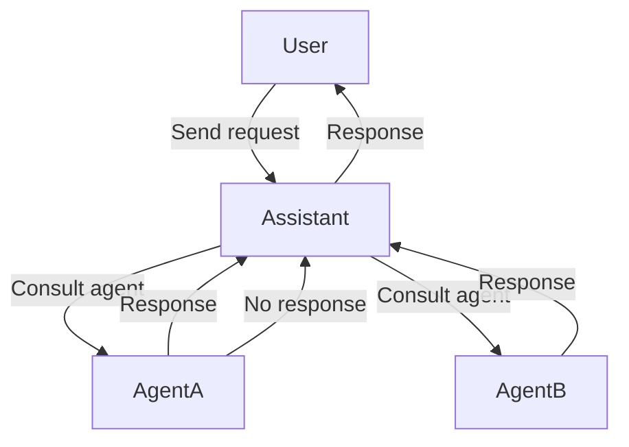

## Simple AI Assistant

---


```mermaid
graph TD
    User --> |Send request| Assistant
    Assistant --> |Consult agent| AgentA
    AgentA --> |Response| Assistant
    AgentA --> |No response| Assistant
    Assistant --> |Consult agent| AgentB
    AgentB --> |Response| Assistant
    Assistant --> |Response| User
```

### Run application

> [!WARNING]
> Make sure you have set the correct values ​​in the .env file beforehand

```bash
docker compose up
```
