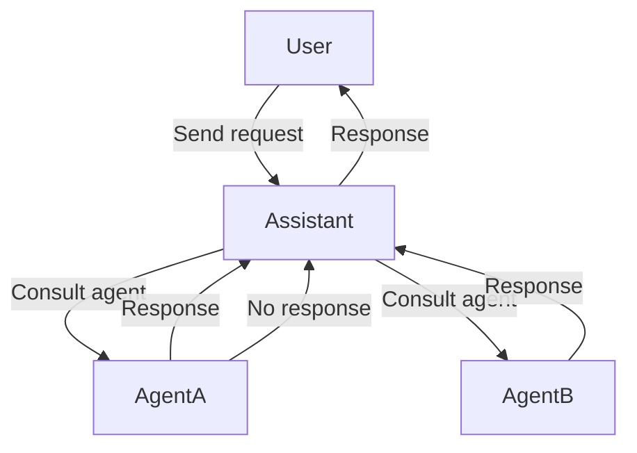

## Simple AI Assistant

---



### Run application

> [!WARNING]
> Make sure you have set the correct values ​​in the .env file beforehand

##### Quick start using docker

```bash
docker compose up
```

The application is running on [http://127.0.0.1:8080](http://127.0.0.1:8080)

##### Run manually

you must first have “uv” installed on your machine.

go to project and sync the project dependencies

```bash
cd streamlit-ai-agents
uv sync --all-extra
```

Then activate the virtual environment
Linux/Mac

```bash
source .venv/bin/activate
```

Then you can start the server

```bash
streamlit run main.py
```

You can also start the server without enabling the uv environment

```bash
uv run streamlit run main.py
```

#### Run tests

```bash
pytest
```
